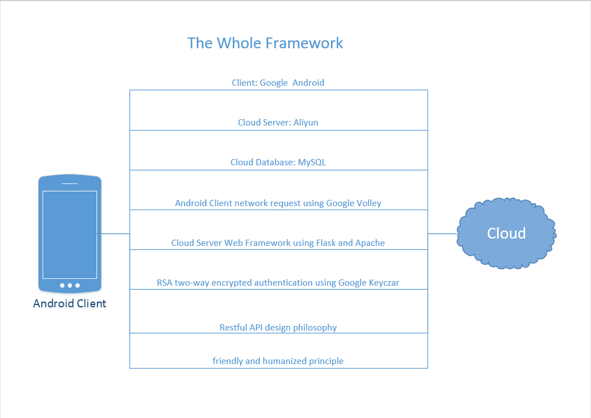
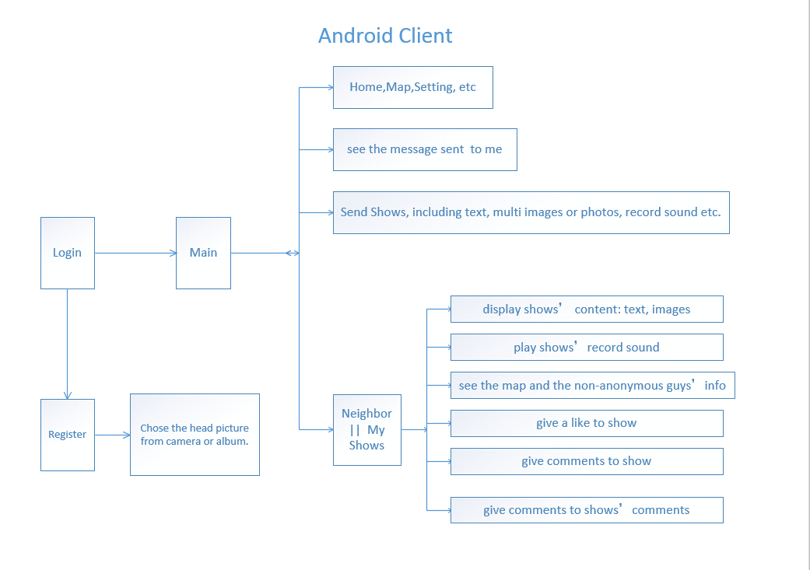
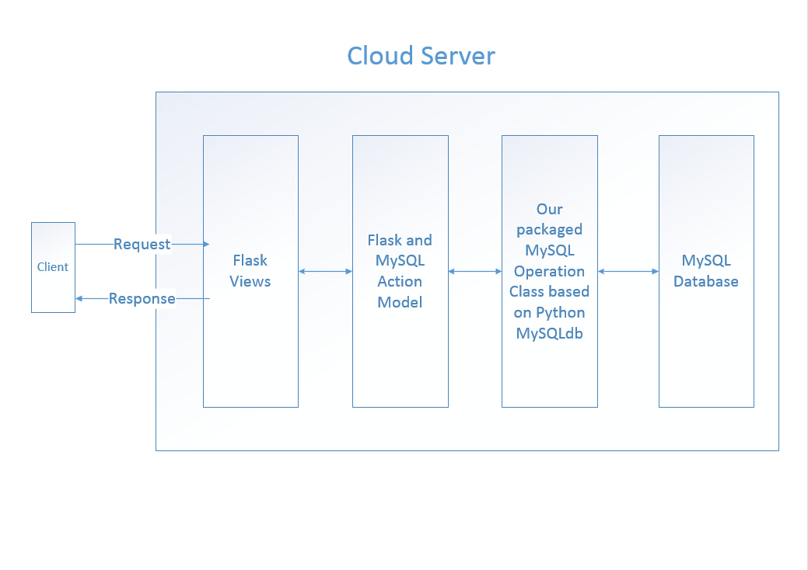
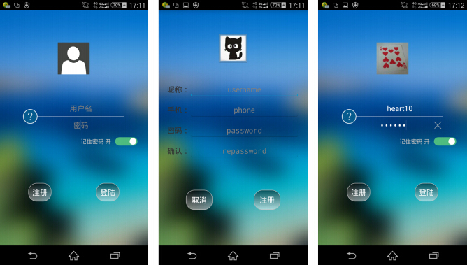
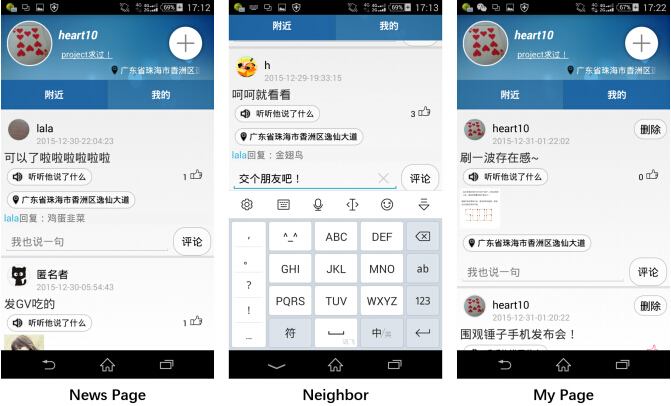
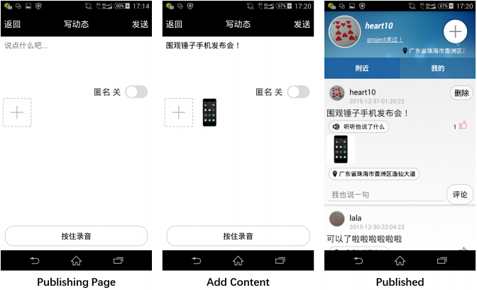
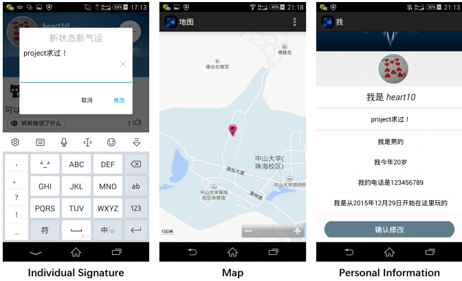

# Nower
基于同一位置的类似微信朋友圈的互动社交 APP

`\ER\`：数据库设计

`/Android_Client_Source/`：    Android客户端工程源码，主工程为Enjoyit

`/Python_Cloud_Server_Source/`： 云端服务器Python2.7工程源码，基于Python Flask和MySQL，运行：python enjoyit.py

使用的是eclipse，不是AS，不足还有很多，对我这种追求完美的强迫症患者来说是根梗，主要是我找不到我们最初idea的立足点了，凭借的完全是一定要把它做出来的倔强。

